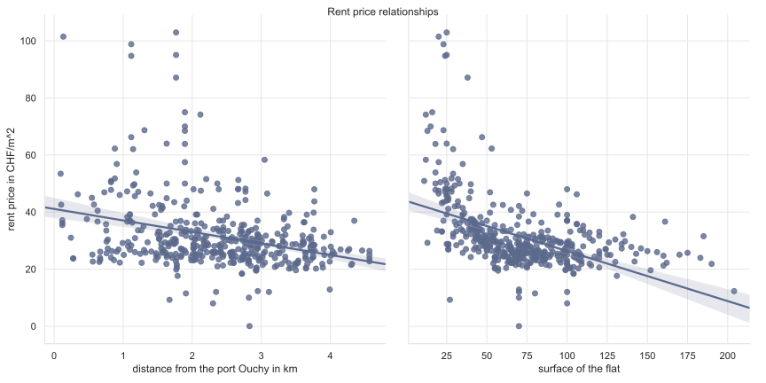

---
# Feel free to add content and custom Front Matter to this file.
# To modify the layout, see https://jekyllrb.com/docs/themes/#overriding-theme-defaults

---

 

From being a simple idea born inside the minds of two men, Brian Chesky and Joe Gebbia, 
unable to afford their rent, to becoming one of the best vacation rental sites, 
AirBnb has come a long way. As a matter of fact, the “air” in AirBnb came as a result of 
Brian and Joe renting an air mattress on their living room floor. 

#### A Bit of Background

Since its foundation in 2008, the company experienced a continuous growth with a boom 
after 2012, ending up to a revenue of 2.6 billions US dollars in 2017, 12736 employees 
in 2019 and an astonishing 2 millions people lodging with AirBnb each night in October 
2019. Today, AirBnb offers listings in 191 countries and counts about 150 millions users 
[1].

Here-above is a graph depicting the worldwide presence of AirBnb from data obtained through
 Inside AirBnb.

With such astonishing numbers, one can’t help but wonder how to get a piece of the pie. 
More specifically, how can short term renting be turned into a sucessful business, to the
 point of being a source of income? If you are interested in the idea of subletting your
  properties and are considering AirBnb as the plateform to do so, then this data story 
  is for you! Indeed, with the help of a thorough analysis of AirBnb data, this article 
  will try to solve the mystery of profitable rentings by determining what makes a 
  listing sucessful.

  
Thus, answers are seeked for the following underlying questions of our problem:
•	What do people look for when booking an airbnb: what variables have the largest 
impact on a listing ?
•	What can be learned from the "big players" and "international players" of the Airbnb 
platform ? Are the same parameters important for all cities ?

#### Defining Success

Before getting down to business by pointing how to get make your listing reach the top, 
let’s get everybody on the same page by detailing what it means for a rented property to 
be successful. Quite naturally, the goal when renting a vacation housing would be to get 
the highest rating accompagnied with good reviews and have custumers all year round. There
 are other indicators such as having customers come back to your place but for the purpose 
 of this study only the three factors listed previously will be taken into account. 
Since customers rate a listing over several criteria such as cleanliness or communication
, an overall rating that takes all of these aspects into account will account for client
satisfaction.
Additionally, due to Airbnb’s international presence, reviews are found in many languages.
 However, the majority of the customers write in English. These are the reviews, 
 which positivity is analysed. Rather than with positivity itself, reviews’ compound 
 values are analyzed. 
A compound value > 0.05 would demonstate positive reviews whereas values < -0.05 amounts 
for negative reviews. For values inbetween, reviews are thought as neutral.
 Finally, the booking frequency is estimated with the average number of reviews wrote for 
 a listing every months. Note that this is only an estimation since not all guests leave 
 reviews and they might have different length of stay. However it does provide information
  on the demand for a listing.

\\

Now that we can all agree on a common definition of success it is time to understand what 
parameters have the most impact on a listing’s success.

insert
GRAPH DISTRIBUTION DES METRICS

By looking at the distribution of the success metric, some simple observations can be 
made. First, the average score is left skewed : very few listings have overall scores 
under 80/100. Then, reviews per months are right-skewed, that is, most listings receive 
very few reviews every months. Finally, the Gaussian distribution of compound values shows
 that most comments have compound values close to 0.5. Virtually no comment is negative, 
 most comments are positive or neutral. These distributions were obtained when inspecting
  the values of a single city : Amsterdam, which analysis is talked more in depth in the 
  next section.

#### Zooming into one of Europe’s most touristic cities: Amsterdam

To get more insight, the analysis is focused, as a first step, on Airbnb usage in 
Amsterdam. Setting the focus on Amsterdam yields meaningful results as Amsterdam ranks 
fifth in the ranking of Europe’s most visited cities, setting the focus on it. Such 
preliminary analysis is done to confirm some hypothesis that might come to mind 
spontaneously.  Certainly, anyone who’s ever gone on a touristic trip has developed some 
preferences in terms of housing. Indeed it can be expected for someone sightseeing 
Amsterdam to want a rental place near the center for a good price and maybe with some 
services offered such as breakfast. However the demography of travellers can be very 
diversed. Based on the age, interest, contry of origin and more, the interest for a 
listing can be very different from one Airbnb user to another. 

insert SANKEY PLOT 

By placing your mouse on every connection between a parameter and the success metric 
it influences you can get the weight of this particular connexion. These weights reveal 
how much a parameter has influence over the different aspect of a listing’s success.
 Because of the considerable amount of parameters that are considered in this research, 
 the second plot focuses only on the 8 most important ones. As far as the owners of 
 Airbnbs in Amsterdam as conserned, in order to maximize their chance at success, they 
 hould focus their energy on:
-	increasing the number of amenities they offer to the renters as well as their response
 rate,
-	optimizer the pricing of their property
-	renting entire appartement that are closte to public transports station.
Also, the longest one has been hosting travelers, the more successful the listing.

However, these results were obtained by looking at all the listings in Amsterdam. Let’s 
not forget you want to get your property to the top. Therefore, it is time to bring our 
analysis to an internationational level. That’s right, needs might differ with respect 
to where you decide to rent holiday housings. Indeed, some towns might be more prone to 
extensive exploration of touristic attractions whereas others might be more prone to 
enjoying tranquility by the pool or the beach for example. Let’s find out if these results
 can be generalized in order to give you the best tools to owning a successful listing.
 
 
 #### From a single city to a worldwide view

Even though interesting results were drawned in the previous section, it is time to go 
even further by investigationg highly touristic cities across the world. 

Let’s begin with the study of every aspect of success individually: for every country 
available on both the transport and airbnb dataset, let’s find out what aspect of a 
listing have the most impact on the booking frequency (review_per_month), the grade 
(review_score) and the positivity of the comments (compound) individually. 



GRAPH POLAR + HEATMAP AVEC ONGLET POUR COMPOUND, REVIEWS AND BOOKING FREQUENCY

A first interesting information at this point is how cities can be clustered on their 
parameters relevance in the success of a vacation rental. Indeed, 8 city-clusters appears.

PLOT POWERPOINT QUI REGROUPE LES CLUSTER

Directly following the first observation is that, as expected, what influences success 
varies depending on your location. For example, the time elapsed since one has been a 
host on Airbnb is the second most relevant parameter to getting good grades in cities 
in the fifth cluster whereas it only is the forth one for cities in the tenth cluster. 

Now that it is known for a fact that the location matters for how to handle your reting
 property, it is time to understand which parameters it would be in your best interest 
 to improve as best as possible. For that, a multi-target study might come in handy. 
 Indeed, it is time to look at success by considering all its aspects and to come up 
 with the best strategy for you to access the hosts’ elite. 

GRAPH POLAR + HEATMAP DE LA MULTITARGET ANALYSIS

Among all the parameters inspected througout this article, they can finally be topped 
down to 8 key features with the most effect on the success of a listing. These features 
are: 
-	The distance between the housing and the neirest public transportation station
-	The minimum amount of night allowed for a stay
-	The host being a superhost
-	The overall price
-	The price per person 
-	The host response rate
-	How long has the host been renting properties on airbnb
-	The total amount of properties the host has for rent online
-	The number of amenities proposed by the host

You might be panicking at this point, thinking you won’t be able to improve all these 
features. Well, there is no need to be alarmed: if you plan on renting your property in 
a town presented in this study, you’ll just have to identify the town-cluster to wich it 
belongs and then you can find an even smaller list of parameters to improve in order to 
increase your chances of success! 
For example, if you happen to own a real estate that you would like to rent in a town of 
the ninth cluster, then you only have to set your focus on the number of amenities you 
offer, the minimum nights you allow, the proximity with public transportation stations, 
your response rate and being patient because the experience of the host (time elapsed 
since the first rental) also has effect on the success of your listing. 

#### Conclusion and discussion

At the end of this analysis, we truly hope you will get the best results (and income) 
with your listing. Eventhough the competition is tough, remember that few elements can 
improve a big deal your chance at success. Also keep in mind that the parameters that 
most influence your future success will also depend on where your housing will be located.
 However, tourists’ expectations do meet in particular places regardless of the 
 destination. As expected, most travelers aim for affordable places (price, 
 price_per_person, minimum_nights) close to public transportations 
 (distance_nearest_station) rented by a host they feel they can trust based on their 
 experience (host_since, superhost, high response rate) and that has a lot to offer 
 (number_of_amenities).

#### reste du truc des autres

[_quartiers_][quartiers_lausanne].

- The owner with the most parcels in Lausanne is the municipality.

- The _quartiers_  _Montriond_ and _Ouchy_  are clearly more expensive
  than the rest.

- The city centre is mostly owned by corporations,
  _Chailly_ is mostly owned by privates.

- There is no direct relation between owner type and prices. The market seems to
  adjust prices uniformly over the ownership types.

- The price per square meter of a flat is strongly influenced by the distance to the
  _lac Léman_ and by the surface of the flat. Smaller flats cost more
  per square meter than large flats.



Our first [dataset][asit] consists of the geographical, [cadastral] and address
data behind [map.lausanne.ch](https://map.lausanne.ch). It features the owner of
each of the almost 8000 plots or parcels (of land) in Lausanne.
There are about 4000[^1] entities possessing
real estate and they are as diverse as you would imagine them, ranging from the
municipality, to private people, to even multinational companies like Crédit
Suisse, Phillip Morris International or the pension fund of Swatch.

[^1]:  
    This number does not account for PPE (_prorpiété par étage_). If a house's
    flats are owned by individuals the dataset does not distinguish the
    different owners. It just indicates PPE.

#### Ownership types

The owner with the most parcels is unsurprisingly the **city of Lausanne**. With
1265 parcels it owns 12% of all parcels. This is ten times more than the next
two owners which are the pension funds of the city and of the canton Vaud.
Because most owners only have a small amount of parcels we will group them into
7 types:

{: .owner-legend }
 - {: .public } public institutions: _the city, the swiss railways etc._

- {: .pension } pension or similar funds: _investment foundations, the city's
  pension fund, etc._

 - {: .corp } corporations: _listed public companies like Swiss Life S.A., Régie
  Chamot & Cie S.A. etc._

 - {: .coop } cooperatives: _registered cooperative companies like Migros, la
  Mobilière etc._

 - {: .foundation } foundations and associations: _for example the olympic foundation for
    cultural heritage._

 - {: .ppe } PPE: _single flats in a building owned by different private people
 -- in french_ proriété par étage.

 - {: .private } individual privates: _private citizens owning an entire building._

If we look at the data as a map a very noisy mosaic shows up.

With this cleaner picture, some patterns emerge. The eastern _quartier_
_Chailly_ is dominantly owned by privates. Big parks, the lakeside and the rail
lines are of course possessed by public institutions and the centre of the city
has the highest density of corporations.

#### Diversity

The fact that the two maps are different shows that there is a lot of diversity
in some _quartiers_' ownership patterns. In order to see which _quartiers_ are
the most diversely owned, we computed another map that measures the diversity
with the [Shannon entropy] of the owners in a circle around each parcel.

<iframe src="assets/export/entropy_owners.html"></iframe>

Unsurprisingly, the large parks, the airport and the lakeside which all belong
to the city have low  entropy in their ownership patterns. That means there is a
local monopoly of owners. While this was expected for the city's properties it
is rather a discovery for the [_Flon_] in the centre of the city. This area is
red as well because a single corporation (_LO Immeubles S.A._) owns all of the
properties in the _Flon_!



If you visit a real estate portal you see something like
[this][homegate_example]. You don't get a global view of the area and its
prices. To overcome this, we collected the listings from the three most
important swiss platforms ([Anibis](https://www.anibis.ch/),
[Homegate](https://www.homegate.ch/) and [Tutti](https://www.tutti.ch/)). After
removing duplicates and fake offers this gave us 469 offers with prices in
CHF/m2. By combining them with our geographical data from before, we
can present them in the map below.

<iframe src="assets/export/by_rents_all_in_one.html"></iframe>





[^2]: All images are from [wikimedia commons](https://commons.wikimedia.org/wiki/Category:Lausanne).

[_Ouchy_]: https://map.geo.admin.ch/?lang=en&topic=ech&bgLayer=ch.swisstopo.pixelkarte-farbe&layers=ch.swisstopo.zeitreihen,ch.bfs.gebaeude_wohnungs_register,ch.bav.haltestellen-oev,ch.swisstopo.swisstlm3d-wanderwege&layers_visibility=false,false,false,false&layers_timestamp=18641231,,,&E=2537733&N=1150883&zoom=7.498594761554026&crosshair=marker

[_Flon_]: https://map.geo.admin.ch/?lang=en&topic=ech&bgLayer=ch.swisstopo.pixelkarte-farbe&layers=ch.swisstopo.zeitreihen,ch.bfs.gebaeude_wohnungs_register,ch.bav.haltestellen-oev,ch.swisstopo.swisstlm3d-wanderwege&layers_visibility=false,false,false,false&layers_timestamp=18641231,,,&E=2537831&N=1152550&zoom=7.896666666666668&crosshair=marker

[Shannon entropy]: https://en.wikipedia.org/wiki/Entropy_(information_theory)
[linear regression]: https://en.wikipedia.org/wiki/Linear_regression
[k-nearest-neighbours]: https://en.wikipedia.org/wiki/K-nearest_neighbors_algorithm
[asit]: https://www.asitvd.ch/chercher/catalogue.html?view=sheet&guid=486&catalog=main&type=complete&preview=search_list
[cadastral]: https://en.wikipedia.org/wiki/Cadastre
[homegate_example]: https://www.homegate.ch/rent/real-estate/city-lausanne/matching-list?tab=list&o=sortToplisting-desc
[quartiers_lausanne]: https://www.lausanne.ch/en/officiel/statistique/quartiers/presentation-des-quartiers.html
[_zones foraines_]: https://www.lausanne.ch/en/officiel/statistique/quartiers/presentation-des-quartiers/90-zones-foraines.html
